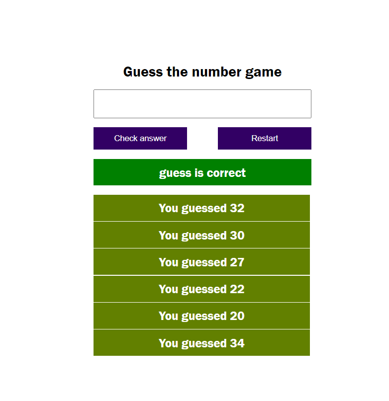

# Guess the Number Game

A simple number guessing game implemented in JavaScript.

## Introduction

This repository contains a JavaScript-based "Guess the Number" game. The objective of the game is to guess a randomly generated number within a specified range. The game provides feedback on whether the guessed number is higher or lower than the target number, allowing the player to narrow down their guesses until they find the correct number.

## Features

- Randomly generates a target number within a specified range.
- Allows the player to enter their guess and provides feedback.
- Tracks the number of attempts made by the player.
- Notifies the player when they guess the correct number.
- Supports custom range settings.

## Technologies Used

The game is built using the following technologies:

- **JavaScript:** The core programming language used to implement the game logic.
- **HTML:** The user interface is created using HTML to capture user input and display feedback.
- **CSS:** Basic styling is applied to enhance the visual appearance of the game.

## Usage

1. Clone or download this repository to your local machine.

2. Open the `index.html` file in your web browser.

3. Specify the range of numbers you want to play with.

4. Start guessing numbers and receive feedback until you find the correct answer!

## Screenshots

## Contributing

Contributions are welcome! If you find any issues or have suggestions for improvements, please feel free to submit a pull request.

## License

This project is licensed under the [MIT License](MIT.md).

